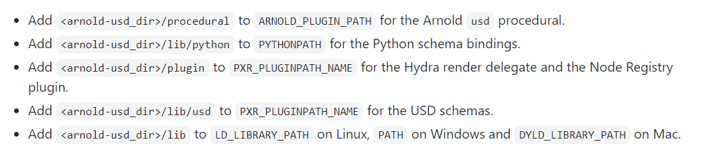

# arnoldUSD

compiled library for usd core version 20.08 from Autodesk repo in https://github.com/Autodesk/arnold-usd

Yo need to  set these environmental variables to be able to use this library

 

    
You cand find download material  like tutorials and assets to test USD in : http://graphics.pixar.com/usd/downloads.html

